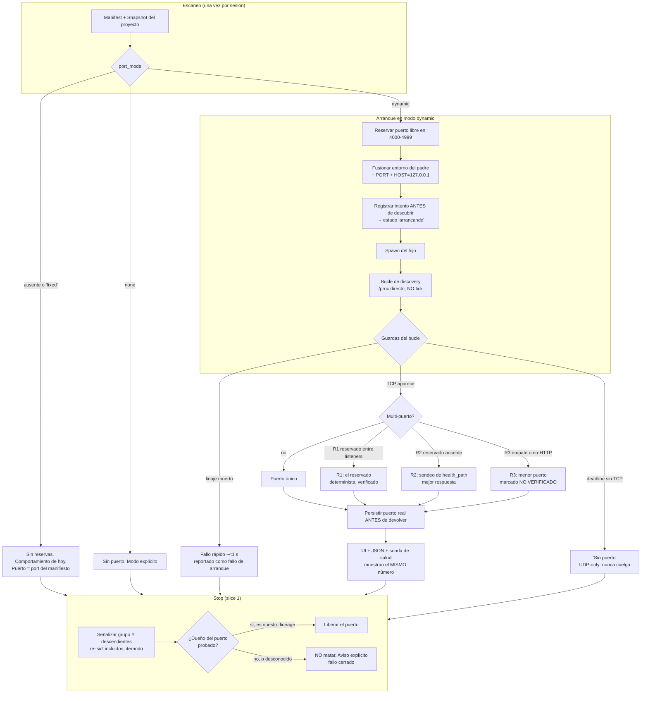
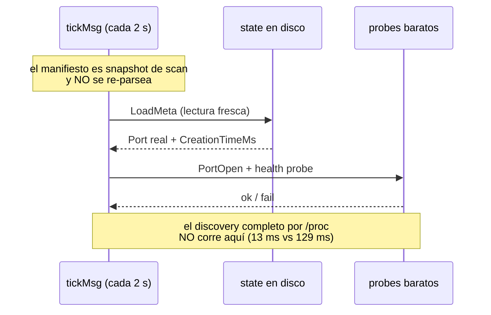
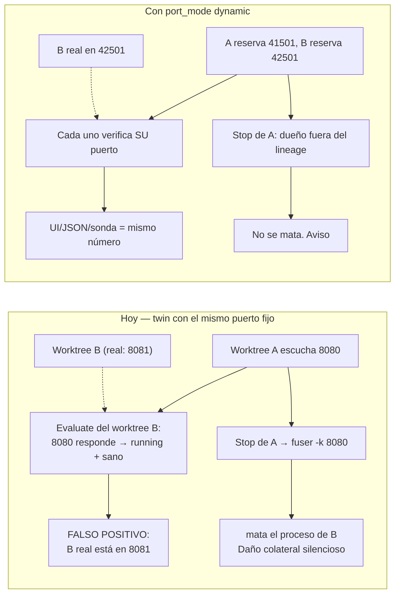

# Feature flow — puertos dinámicos

Derivado de `behavior.feature`. Mermaid.

```mermaid
flowchart TD
    subgraph SCAN["Escaneo (una vez por sesión)"]
        A["Manifest + Snapshot del proyecto"] --> B{"port_mode"}
    end

    B -->|ausente o 'fixed'| C["Sin reservas. Comportamiento de hoy.<br/>Puerto = port del manifiesto"]
    B -->|"none"| D["Sin puerto. Modo explícito"]
    B -->|"dynamic"| E

    subgraph START["Arranque en modo dynamic"]
        E["Reservar puerto libre en 4000-4999"] --> F["Fusionar entorno del padre<br/>+ PORT + HOST=127.0.0.1"]
        F --> G["Registrar intento ANTES de descubrir<br/>→ estado 'arrancando'"]
        G --> H["Spawn del hijo"]
        H --> I["Bucle de discovery<br/>/proc directo, NO tick"]
        I --> J{"Guardas del bucle"}
    end

    J -->|"linaje muerto"| K["Fallo rápido ~&lt;1 s<br/>reportado como fallo de arranque"]
    J -->|"TCP aparece"| L{"Multi-puerto?"}
    J -->|"deadline sin TCP"| M["'Sin puerto'<br/>UDP-only: nunca cuelga"]

    L -->|"no"| N["Puerto único"]
    L -->|R1 reservado entre listeners| O["R1: el reservado<br/>determinista, verificado"]
    L -->|R2 reservado ausente| P["R2: sondeo de health_path<br/>mejor respuesta"]
    L -->|"R3 empate o no-HTTP"| Q["R3: menor puerto<br/>marcado NO VERIFICADO"]

    N --> R["Persistir puerto real ANTES de devolver"]
    O --> R
    P --> R
    Q --> R
    R --> S["UI + JSON + sonda de salud<br/>muestran el MISMO número"]

    S --> STOP
    D --> STOP
    C --> STOP

    subgraph STOP["Stop (slice 1)"]
        T["Señalizar grupo Y descendientes<br/>re-'sid' incluidos, iterando"]
        T --> U{"¿Dueño del puerto<br/>probado?"}
        U -->|"sí, es nuestro lineage"| V["Liberar el puerto"]
        U -->|"no, o desconocido"| W["NO matar. Aviso explícito<br/>fallo cerrado"]
    end

    K --> STOP
    M --> STOP
```

## El tick NO descubre

```mermaid
sequenceDiagram
    participant Tick as tickMsg (cada 2 s)
    participant Store as state en disco
    participant Probe as probes baratos

    Note over Tick: el manifiesto es snapshot de scan<br/>y NO se re-parsea
    Tick->>Store: LoadMeta (lectura fresca)
    Store-->>Tick: Port real + CreationTimeMs
    Tick->>Probe: PortOpen + health probe
    Probe-->>Tick: ok / fail

    Note over Tick,Probe: el discovery completo por /proc<br/>NO corre aquí (13 ms vs 129 ms)
```

## El fallo que esta feature mata

```mermaid
flowchart LR
    subgraph HOY["Hoy — twin con el mismo puerto fijo"]
        H1["Worktree A escucha 8080"] --> H3["Evaluate del worktree B:<br/>8080 responde → running + sano"]
        H3 --> H4["FALSO POSITIVO:<br/>B real está en 8081"]
        H2["Worktree B (real: 8081)"] -.-> H3
        H1 --> H5["Stop de A → fuser -k 8080"]
        H5 --> H6["mata el proceso de B<br/>Daño colateral silencioso"]
    end

    subgraph NUEVO["Con port_mode dynamic"]
        N1["A reserva 41501, B reserva 42501"] --> N3["Cada uno verifica SU puerto"]
        N3 --> N4["UI/JSON/sonda = mismo número"]
        N2["B real en 42501"] -.-> N3
        N1 --> N5["Stop de A: dueño fuera del lineage"]
        N5 --> N6["No se mata. Aviso"]
    end
```