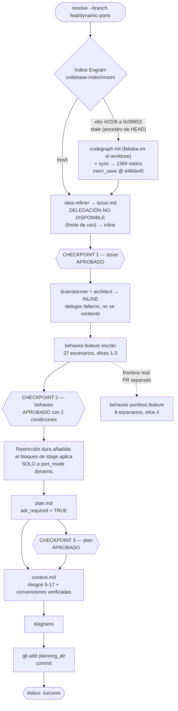
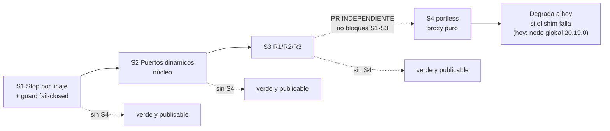
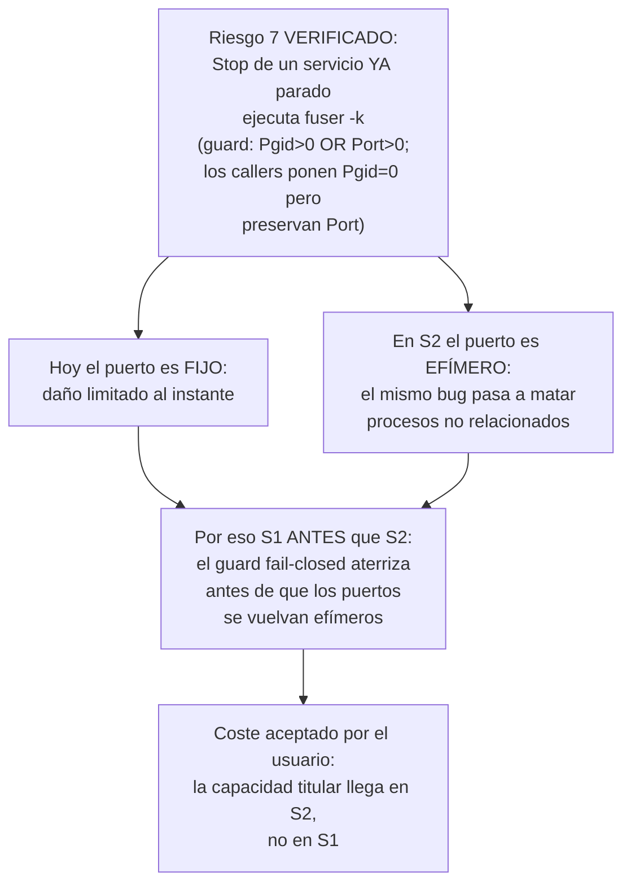
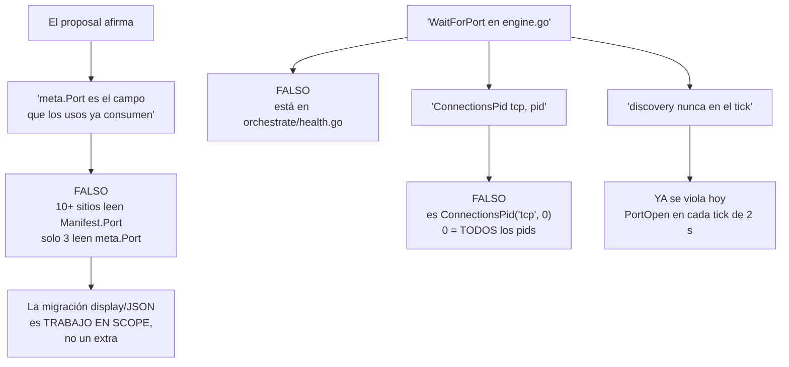
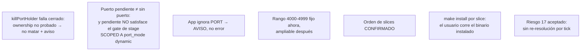

# Process flow — planificación de `dynamic-ports`

Decisiones reales que se tomaron para ESTE cambio. No es boilerplate.

## Orden de slices decidido

## Por qué S1 va primero

## Disposición de riesgos 5-17 (13 guards, 1 aceptación)

```mermaid
flowchart TD
    AUDIT["Auditoría READ-ONLY<br/>riesgos 5-17"]

    AUDIT --> G5["5 · Env merge<br/>G"]
    AUDIT --> G6["6 · spawn→SaveMeta<br/>G"]
    AUDIT --> G7["7 · Stop ya parado<br/>G (S1)"]
    AUDIT --> G8["8 · WaitForPort(0)<br/>G, solo dynamic"]
    AUDIT --> G9["9 · ownerless → running<br/>G"]
    AUDIT --> G10["10 · dual-stack<br/>G"]
    AUDIT --> G11["11 · Meta.State write-only<br/>G"]
    AUDIT --> G12["12 · pending = vivo<br/>G"]
    AUDIT --> G13["13 · port==0 en 7 sitios<br/>G"]
    AUDIT --> G14["14 · constantes duplicadas<br/>G"]
    AUDIT --> G15["15 · Validate no aplica<br/>G"]
    AUDIT --> G16["16 · tripwire test<br/>G"]
    AUDIT --> D17["17 · puerto cambia entre ticks<br/>D ACEPTADO<br/>+ sub-guard: nunca mezclar generaciones"]

    RULING["Descartados por auditoría<br/>(no gastar presupuesto)"] --> X1["daemon_windows.go es stub<br/>→ StartResult es seguro"]
    RULING --> X2["PathKey hashea la ruta<br/>→ worktrees ya separados"]
```

## Divergencia proposal → realidad (corregida)

## Decisiones del usuario en los checkpoints

