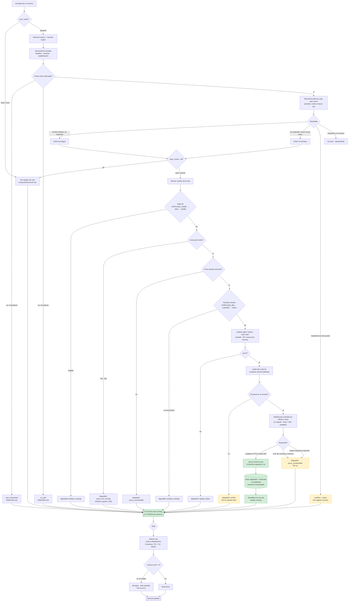

# Feature flow — vroom registra rutas en portless

Derivado de `../behavior.feature`. El recuadro verde es el **único** camino donde
el servicio obtiene una dirección verificada; todo lo demás degrada sin tocar la
salud.

## Las dos verificaciones, y por qué son dos

Por **M1**, `alias` es una escritura pura del fichero de estado: **nunca contacta
con el proxy**. Con el proxy parado sale `exit 0` y escribe la ruta igual. Por eso:

- `N1` (leer de vuelta) existe por **M8**: `alias` es un upsert incondicional sin
  detección de conflictos, así que `exit 0` no prueba propiedad. Sin `N1`, `D6` es
  inalcanzable y vroom publicaría una url ajena.
- `V1` (verificar contra el proxy vivo) existe por **M1/M2**: leer el fichero sólo
  prueba que escribimos. Sin `V1`, `D7` es inalcanzable y una ruta muerta se
  reportaría como disponible.

## Por qué `502` es éxito

En `V2`, un `502` cae en la rama verde. Un `502` significa "el proxy enruta esta
ruta y el servicio de detrás no responde", que es información **distinta** de "el
proxy no sirve la ruta". Sólo un fallo de conexión o un timeout significa que no
hay proxy. Confundir los dos convierte una comprobación en una afirmación falsa.

## Por qué la reconciliación es obligatoria

Por **M5**, `prune` no toca las rutas de alias (`pid: 0`, contadas como `active`).
**vroom es lo único que puede limpiarlas.** Sin `REC`, las rutas de un vroom que
murió serían permanentes; con `REC`, se recogen en el siguiente arranque.

Y la línea que no se negocia: `CF` **avisa y no borra**. Una ruta que responde y no
es nuestra puede ser de otro vroom vivo. El fallo cerrado que gobierna todo el
cambio de puertos aplica también a la limpieza.

## Lo que este diagrama no tiene

Ninguna arista sale de `A` hacia un fallo de arranque, y ninguna flecha de
degradación toca el estado del servicio. Una ruta es una dirección, no una
dependencia.