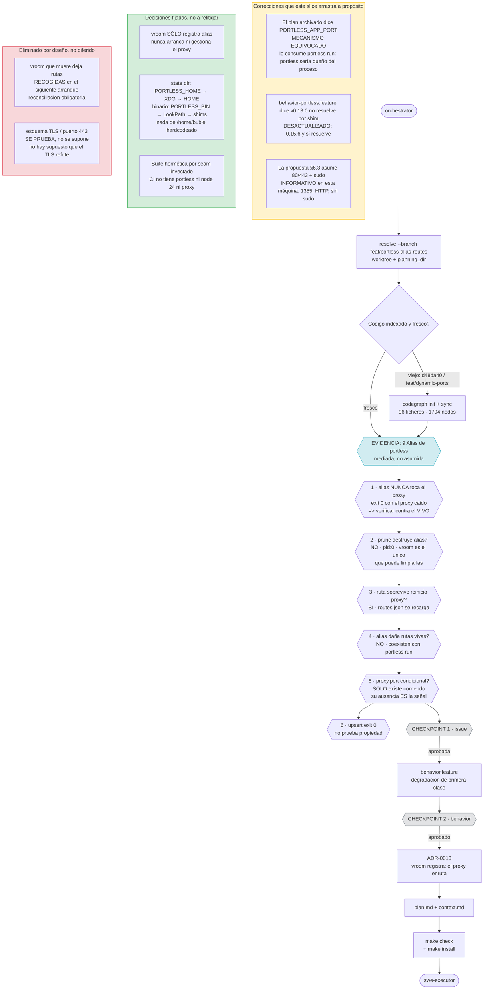

# Process flow — planificación de `feat/portless-alias-routes`

Slice 4 de 4. Los slices 1–3 están mergeados y **no se tocan**.

## Decisiones de este cambio, con lo descartado

| Decisión | Descartado | Por qué |
|---|---|---|
| Mecanismo: `portless alias <name> <port>` | `PORTLESS_APP_PORT` | Lo consume `portless run`, donde portless es dueño del proceso |
| Conocer el puerto del proxy: `proxy.port` + guarda de fichero ausente | raspar `doctor`; API HTTP; asumir `1355` | `doctor` cambia entre versiones; no hay API (todo `404`); `proxy.port` sólo existe corriendo |
| Verificar: leer de vuelta **y** una sonda al proxy vivo | sólo leer `routes.json`; sólo `exit 0`; `portless get` | `alias` no toca el proxy, luego el fichero sólo prueba que escribimos; `get` prefija la rama |
| Esquema de la URL: se prueba (`https` luego `http`) | suponerlo de la configuración | No hay supuesto que el TLS pueda refutar; no hizo falta medirlo |
| Limpieza: reconciliación obligatoria en cada arranque | `portless prune`; un `vroom route prune` aparte; borrar en silencio | `prune` no toca `pid:0`; borrar una ruta viva ajena contradice el fallo cerrado |
| Nombre: `route_mode = off\|auto\|named` + `route_name` | un solo `route = ""\|auto\|"nombre"` | La rama no es estable ante `git branch -m`; un enum ambiguo documenta su tipo en el schema |
| State dir y binario: derivados del entorno | `/home/buble/.portless`; `portless` a pelo | vroom corre bajo un gestor de servicios que no es el shell de login |
| Falta de portless: aviso | error de arranque | Contradice `adr-0012` limitación 6 |