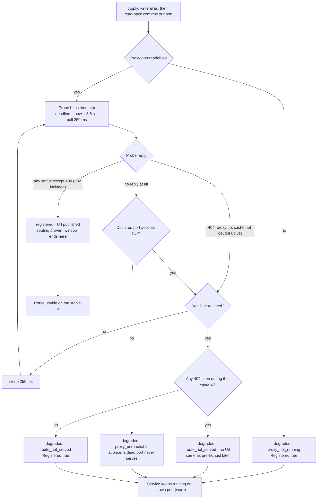
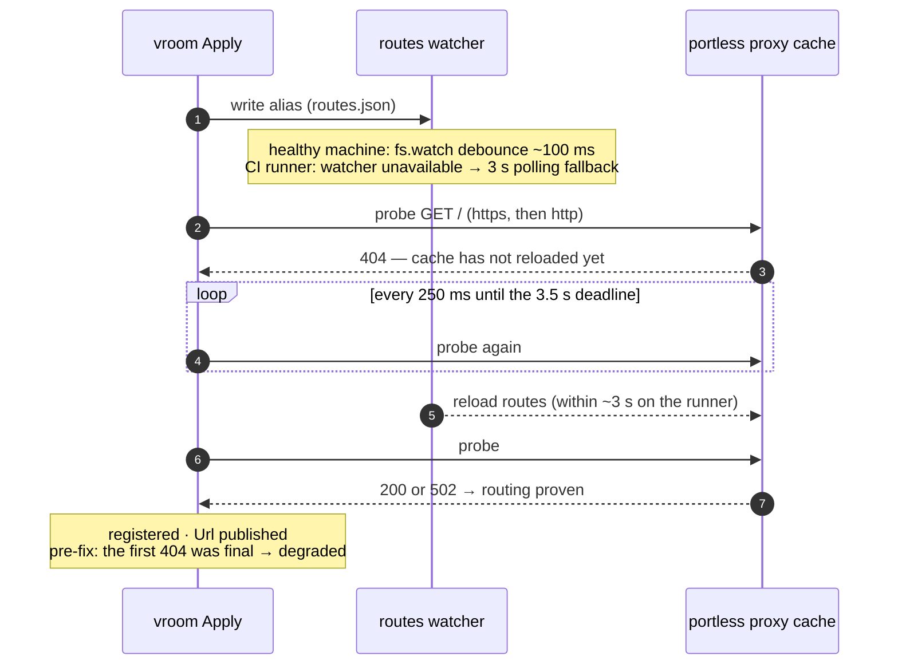

# Feature flow — `fix/ci-integration-proxy`

Derived from `behavior.feature`: what `Apply` does with a freshly written portless route, and the propagation race the fix addresses.

## Verify: state flow (post-fix)

Reading notes:

- Pre-fix, a first-probe 404 was final → `degraded · route_not_served` (the deterministic CI failure on the inotify-starved runner).
- `WithVerifyWait(0)` collapses the loop to the old single immediate probe (deterministic fakes pin it); `New()` installs the 3.5 s / 250 ms defaults.
- The retry only extends a **404**; any other answer, 502 included, stands as proof of routing and returns the published Url.

## The CI race: apply vs proxy cache

