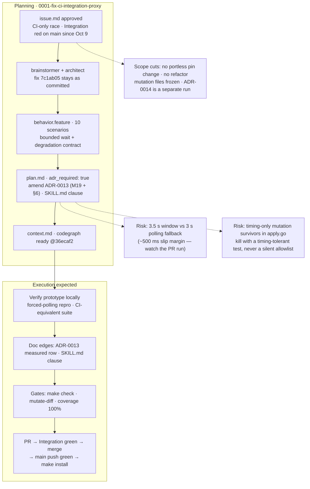

# Process flow — `0001-fix-ci-integration-proxy`

Planning → execution flow for this promoted run. Branch `fix/ci-integration-proxy`; the prototype commits `7c1ab05` (fix) and `36ecaf2` (repro) are already on the branch and are the **change under test**, not a proposal to redo.

