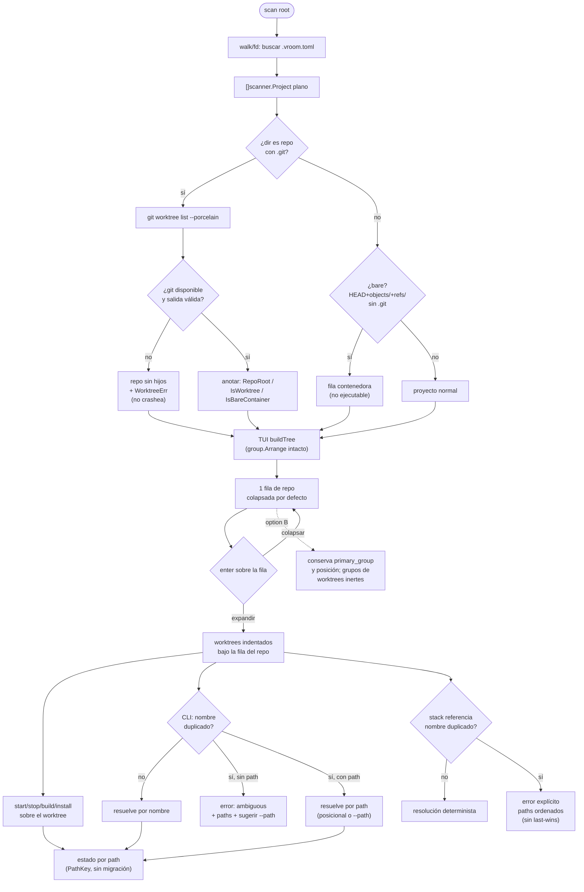

# Feature flow — 0011 Worktrees de git anidados

Flujo de comportamiento derivado de `behavior.feature`. Muestra el ciclo
scan → anidado → operación, y los dos caminos de ambigüedad (CLI y stacks).

## Notas de comportamiento

- **Colapsado por defecto**: a diferencia de los grupos (expandidos), las filas
  de repo nacen colapsadas; el estado se persiste con clave con namespace propio.
- **Option B**: la fila del repo mantiene su grupo y posición; un worktree que
  declare su propio `primary_group` **no** se reposiciona.
- **Degradación**: la ausencia de git no oculta proyectos ni rompe el scan.
- **Ambigüedad**: el nombre deja de ser identidad; el path es el direccionador
  canónico, tanto en CLI como en la resolución de stacks.
