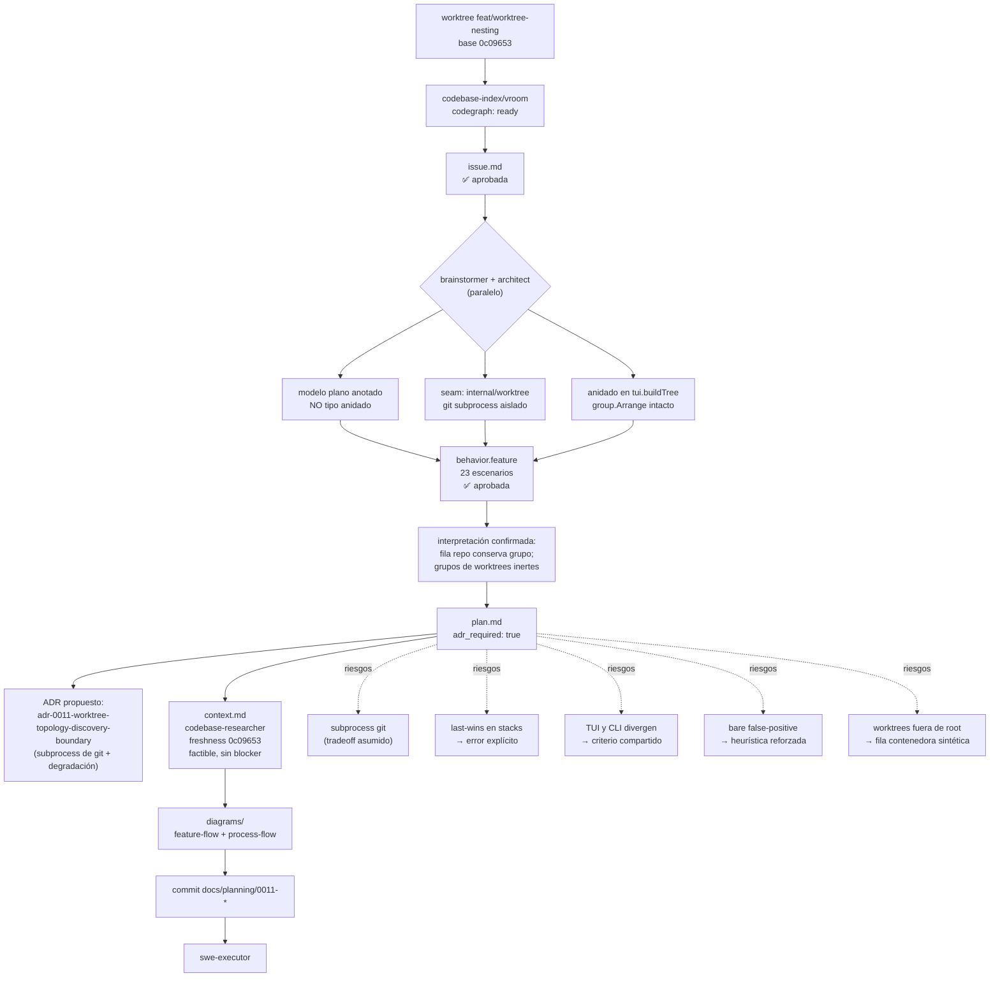

# Process flow — planificación de 0011-feature-worktree-nesting

Flujo de planificación real para esta feature, con las decisiones tomadas.

## Decisiones registradas

| Decisión | Valor |
| --- | --- |
| Modelo | `[]scanner.Project` plano + anotaciones (`RepoRoot`, `IsWorktree`, `IsBareContainer`, `WorktreeErr`) |
| Descubrimiento | nuevo `internal/worktree`; `gitinfo` intacto; degradación por repo |
| Anidado | `tui.buildTree` + `itemRepo`; clave de colapso con namespace, default colapsado |
| Bare repo | heurística `HEAD` + `objects/` + `refs/` sin `.git`, + marcador de bare |
| CLI | path-first (posicional + `--path`); JSON aditivo y plano |
| Stacks | error explícito ante duplicados; criterio compartido TUI/CLI |
| ADR | `adr_required: true` — `adr-0011-worktree-topology-discovery-boundary` |

## Checkpoints

`issue` ✅ → `behavior` ✅ → `plan` ✅ → context pass ✅ → diagramas ✅ → commit
